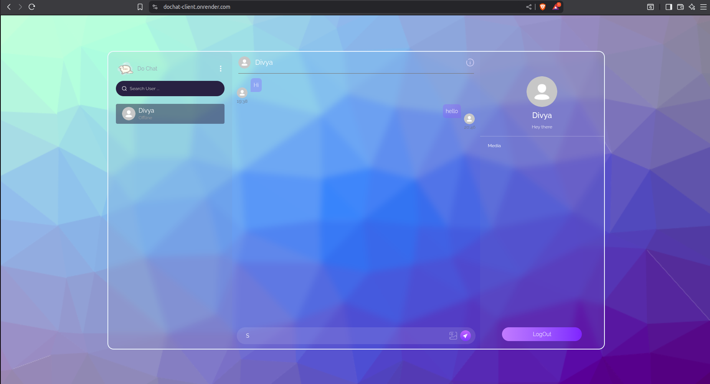
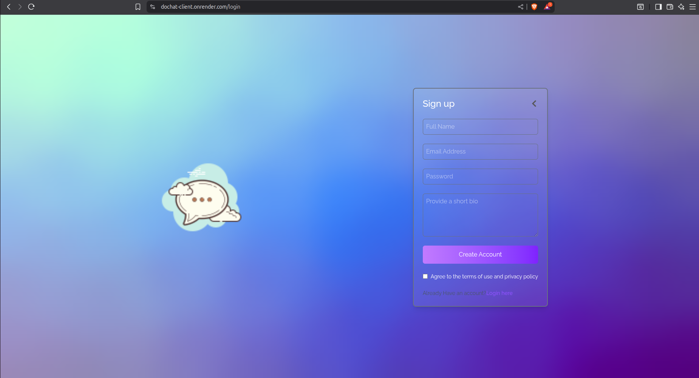

# 💬 DoChat – Real-Time MERN Chat Application  

A modern **real-time chat app** built with the **MERN stack**.  
DoChat lets users connect instantly, share files, track unseen messages, and manage profiles all with a clean, responsive UI.

---


## 🚀 Live Demo

[Try DoChat now!](https://dochat-client.onrender.com)

---

## 🌟 Features

- 🔑 **Authentication** – Secure login & signup with JWT  
- 🟢 **User Presence** – See who’s online in real time  
- 🔍 **User Search** – Find users by name from the user list  
- ⚡ **Real-Time Messaging** – Instant chats powered by Socket.io  
- 📩 **Unseen Messages** – Track unread messages per user  
- 🖼️ **File & Media Sharing** – Upload and share files via Cloudinary  
- 👤 **Profile Management** – Update profile details like name & bio  
- 📱 **Responsive UI** – Built with React + TailwindCSS for a smooth, modern experience  

---

## 🛠️ Tech Stack

**Frontend:**
- React (v19)  
- TailwindCSS  
- React Router  
- React Toastify  
- Socket.io-client  
- Axios  

**Backend:**
- Express.js (v5)  
- MongoDB + Mongoose  
- Socket.io  
- JWT for authentication  
- bcryptjs for password hashing  
- Cloudinary for media storage  
- dotenv, CORS  

---

## 📸 Screenshots / Preview

> 

<br></br>

> 

---

## ⚙️ Installation & Setup


### Prerequisites

* Node.js v16+ and npm
* MongoDB instance (local or Atlas)

### Clone the repository
```bash
git clone https://github.com/your-username/dochat.git
cd dochat
```

### Install dependencies
```bash
npm install             
cd frontend && npm install
cd ../backend && npm install
```


### Create a .env file in server/ with:

- PORT=5000
- MONGO_URI=your_mongodb_uri
- JWT_SECRET=your_jwt_secret
- CLOUDINARY_CLOUD_NAME=your_cloudinary_name
- CLOUDINARY_API_KEY=your_cloudinary_key
- CLOUDINARY_API_SECRET=your_cloudinary_secret
- CLIENT_URL=your_client_url

### Create a .env file in server/ with:

- VITE_BACKEND_URL=your_backend_url

### Run in development

 ```bash
   npm start
   ```

This uses `concurrently` to start both client and server.

---

## Future Improvements

- Group chats support
- Message reactions (👍 ❤️ 😂)
- Dark mode
- Push notifications

---

## 🤝 Contributing

Contributions, issues, and feature requests are welcome!  
Feel free to fork this repo and submit a PR.

---

## ⚖️ License

Distributed under the MIT License. See [LICENSE](LICENSE) for more information.

---

## ✍️ Author

**Kunal Vijay Choudhary**
Final-year CSE Student & Full-Stack Developer

* GitHub: [KunalVChoudhary](https://github.com/KunalVChoudhary)
* Email: [imkunalvchoudhary@gmail.com](mailto:imkunalvchoudhary@gmail.com)
* LinkedIn: [kunal-vijayshree-choudhary](https://www.linkedin.com/in/kunal-vijayshree-choudhary)

---

*Thank U!*